> In order to progress we must recognize our ignorance and leave room for doubt. (Richard Feynman)

<picture>
  <source media="(prefers-color-scheme: dark)" srcset="assets/bandit-stances-dark.svg">
  
</picture>

- 👋 Hi, I’m CodeBoy, a sophomore at ZJUT.
- 🌱 Interested in Algorithms, Systems, Security, and Statistical Learning.

  <!--- --->
 <!------>

 **⊢** **(**  **:**  **→**  **)**

### Programming Languages

  
  
  
  
  
  

### Frontend & Apps

  
  
  
  

### Data

  
  
  

### Cloud Native

  
  
  

### Observability

  
  

<!---
CodeBoy2006/CodeBoy2006 is a ✨ special ✨ repository because its `README.md` (this file) appears on your GitHub profile.
You can click the Preview link to take a look at your changes.
--->
